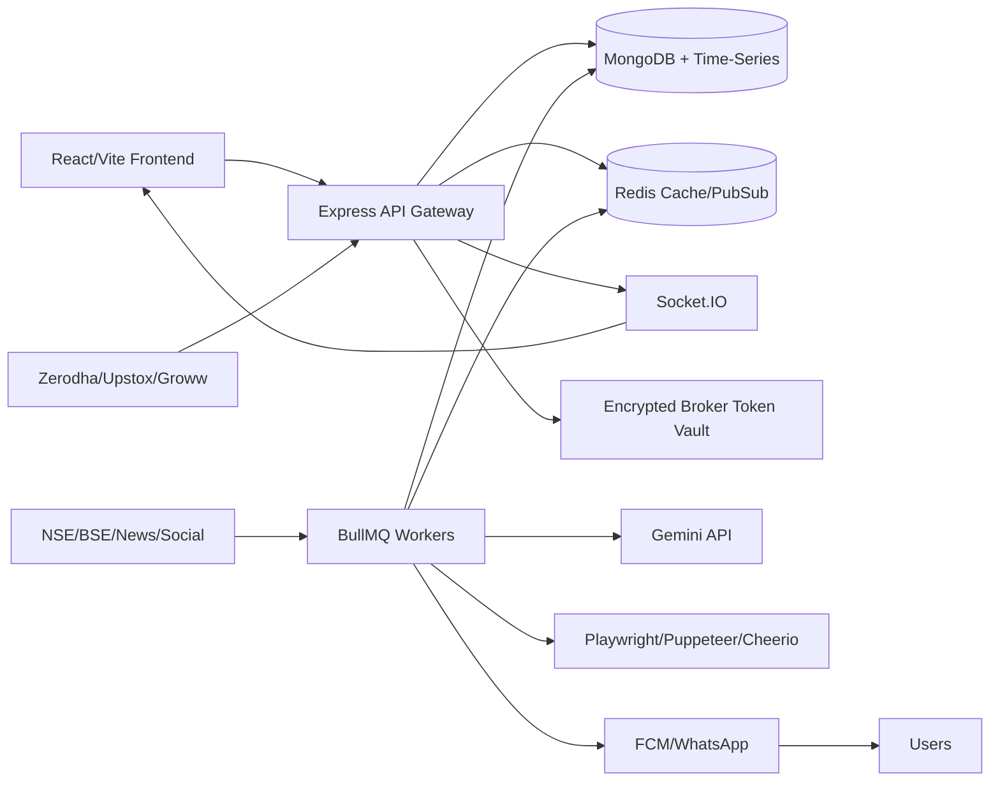

# MarketPulse

MarketPulse is an AI-powered MERN FinTech SaaS platform for Indian market intelligence. The repository contains production-oriented backend APIs, worker pipelines, shared TypeScript contracts, a mobile-first React dashboard, Docker/Nginx/PM2 deployment assets, CI, tests, and operational documentation.

## Architecture



## Monorepo folders

- `apps/backend` — Express.js TypeScript API, auth, RBAC, REST v1, Socket.IO, OpenAPI, Mongo schemas.
- `apps/frontend` — React/Vite/Tailwind dashboard, broker sync, AI insights, charts, alerts, paper trading UI.
- `workers` — BullMQ processors for broker sync, news/sentiment, alerts, corporate actions, social signals, notifications.
- `packages/shared` — shared constants, DTOs, compliance vocabulary, event names, Zod schemas.
- `configs` — Nginx, PM2, Kubernetes-ready manifests.
- `.github/workflows` — CI pipeline.
- `scripts` — sample data seeding and operational helpers.

## Compliance stance

MarketPulse provides informational insights, signals, momentum context, watchlists, opportunities, and risk analytics. It intentionally avoids directive investment language such as “buy”, “sell”, and “guaranteed returns”.

## Quick start

```bash
cp .env.example .env
npm install
npm run build
npm test
docker compose up --build
```

Open the frontend at `http://localhost:5173`, API at `http://localhost:8080/api/v1`, and Swagger at `http://localhost:8080/docs`.

## Production checklist

- Configure all secrets in a managed vault and never commit real broker, Gemini, FCM, or WhatsApp credentials.
- Use HTTPS, secure cookies, strict CORS, Helmet, CSRF protection, rate limits, audit logs, and encrypted broker-token storage.
- Deploy API/workers horizontally; Redis powers BullMQ, Pub/Sub, cache, and alert evaluation.
- Use MongoDB Atlas sharding and time-series retention policies for portfolio snapshots, social mentions, and sentiment history.
- Review SEBI compliance copy before launch and keep all outputs informational.
